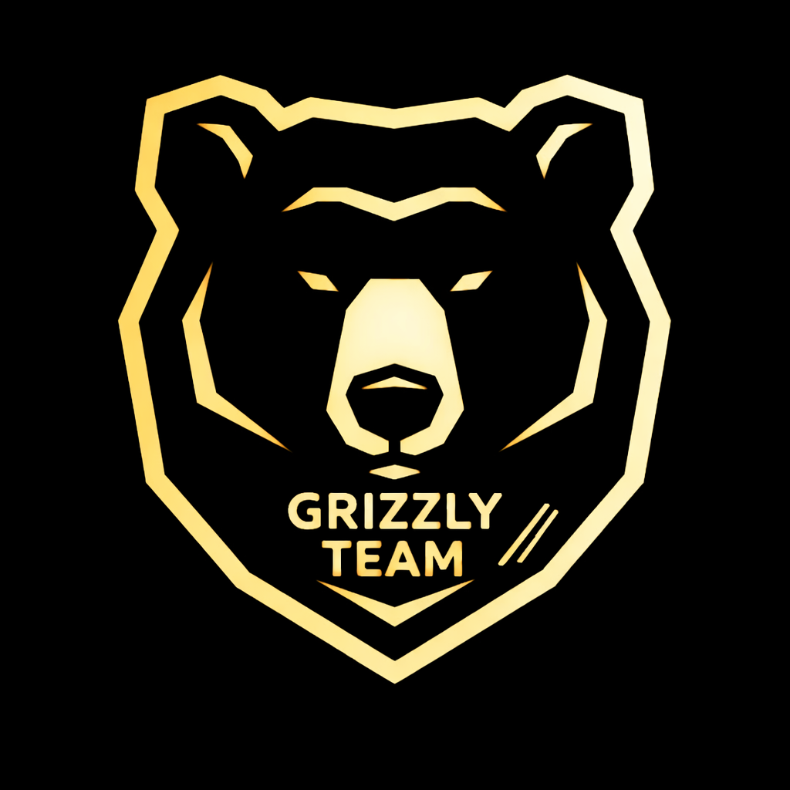

# Grizzly AntiScam v2

**Grizzly AntiScam v2** es una herramienta de seguridad y gestión de webhooks de Discord.  
Permite enviar mensajes, editar webhooks, realizar pruebas de spam controladas y gestionar tus webhooks de forma segura y responsable.

---

## ⚠️ Aviso Legal

- Esta herramienta **solo debe usarse en tus propias webhooks**.  
- No usar con fines maliciosos o para atacar webhooks de terceros.  
- El autor no se hace responsable del mal uso de esta herramienta.  
- Todos los derechos reservados © 2026 Grizzly Studio.  
- No afiliado a Discord Inc.

---

## 🚀 Cómo usar

1. Abre `index.html` en tu navegador (Chrome, Edge, Firefox, etc.)
2. Ingresa tu **Discord Webhook URL** en el campo correspondiente.
3. Haz clic en **Connect** para ver la información de tu webhook.
4. Usa las funciones disponibles según necesites.

o tambien puedes:

1. Clonar este repositorio.
2. Subir los recursos a tu repositorio de github.
3. Subir el proyecto a **Netlify**, **Vercel** u otros.
4. Revisar si el proyecto se subio correctamente y listo.
   
---

## 🛠 Funciones disponibles

### 1️⃣ Conectar webhook
- Botón: **Connect**
- Función: `connect()`
- Qué hace: Obtiene y muestra la información de tu webhook (nombre, canal, ID).

### 2️⃣ Enviar mensajes normales
- Botón: **Send Messages**
- Función: `sendSpam()`
- Qué hace: Envía un mensaje a tu webhook un número específico de veces con un retraso configurable.
- Parámetros:
  - `Mensaje`: El contenido del mensaje
  - `Count`: Número de mensajes a enviar
  - `Delay (ms)`: Tiempo de espera entre cada mensaje

### 3️⃣ Enviar spam rápido
- Botón: **Rapid Spam**
- Función: `rapidSpam()`
- Qué hace: Envía 20 mensajes rápidamente a tu webhook sin retraso.

### 4️⃣ Editar webhook
- Botón: **Update Webhook**
- Función: `updateWebhook()`
- Qué hace: Permite cambiar el **nombre** y el **avatar** de la webhook.

### 5️⃣ Eliminar webhook
- Botón: **Delete Webhook**
- Función: `deleteWebhook()`
- Qué hace: Elimina la webhook permanentemente.  
⚠️ Precaución: Esta acción **no se puede deshacer**.

---

## 👀 Cómo se vería

[Vista de ejemplo de la pagina.](https://grizzlyantiscamv2.netlify.app)

- **Logo arriba** del nombre: Visualmente claro y profesional.
- **Panel de control** con tarjetas separadas para cada función.
- **Footer legal** con copyright y enlace al Discord oficial de nosotros (Grizzly Team's).

---

## 🔗 Enlaces importantes

- Discord oficial: [https://discord.gg/ktJAw3wvSK](https://discord.gg/ktJAw3wvSK)

---

## ⚡ Requisitos

- Navegador moderno (Chrome, Edge, Firefox)
- Conexión a internet
- Hosting para paginas webs (Vercel, Netlify, E.T.C)

---

## 📝 Notas adicionales

- Usa la herramienta de manera responsable y educativa.  
- Antes de enviar spam, recuerda que todo es bajo tu propia responsabilidad.
- Para personalizar el logo, reemplaza `logo.png` en la raíz del proyecto con tu imagen preferida.
